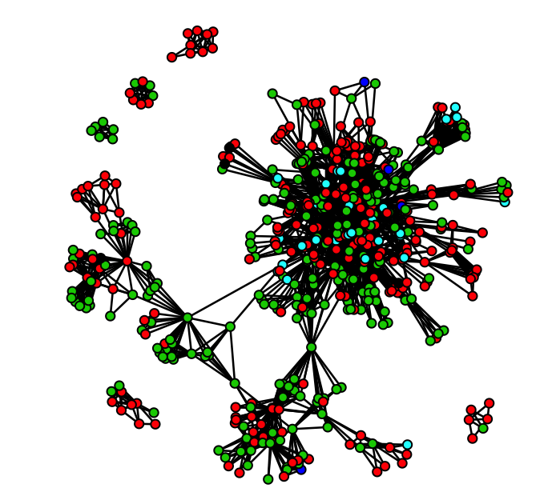

# Course Description

This course lays the groundwork of Social Network Analysis (SNA) from a *Conceptual*, mathematical and *Computational* perspective. SNA differs from other analytic perspectives in requirements for data collection, storage, descriptive, and statistical analysis. The course will address each of these by sampling from a range of the most commonly used classes of analytic concepts, demonstrating for each their implementation in primary data collection efforts and empirical analyses (in R).

We will address these concepts around two organizing principles: (1) the two primary theoretical frameworks capturing reasons networks “matter”; and (2) how each class of measures can be applied across different units of analysis: individuals, groups and “whole” networks. While by no means exhaustive, this course will provide students with the beginning toolkit for SNA. SNA is a rapidly advancing field, and these tools are intended to provide the orienting frameworks that can guide further study of SNA on your own.

## Prerequisites 
No formal statistical training or prior experience with R is assumed. However, students' prior familiarity with statistical and computing principles will enhance the course experience, easing the extension of coursework to your own research. Each course module's presentation will *Conceptual*ly build only from prior material covered in this course. Code templates will be provided for the measurement and computation of each of the introduced concepts. All slides, scripts and data will be posted to github ([https://ssdalab.github.io/EPIC_Networks/](https://ssdalab.github.io/EPIC_Networks/)). Participants should bring a computer for personal use (Windows, Mac or Linux), with R previously installed. We recommend going through the [Intro R Tutorial](https://ssdalab.github.io/IntroR/) before class starts. We will use a number of R packages, which will require that you have privileges on your machine that allow you to install programs/applications. All details about installation of R and RStudio can be found in  [Intro R Syllabus](https://ssdalab.github.io/IntroR/syllabus.html) and details on the necessary packages can be found in [Intro R: Tutorial 5](https://ssdalab.github.io/IntroR/Tutorial5.html) and [Intro R: Tutorial 6](https://ssdalab.github.io/IntroR/Tutorial6.html).

# Course Objectives

By the end of the course, participants will be able to:
1. Understand the primary theoretical & analytic frameworks that underpin SNA.  
2. Grasp the primary strategies for gathering & storing social network data.  
3. Compute & interpret several primary classes of measures, for varying analytic levels.  
4. Describe some of the most commonly observed patterns in empirical networks  
5. Run descriptive & statistical analyses (in R) to identify these patterns in real data.  

# Course Readings

# Course Structure

Class meets from 8:30 AM – 12:30 PM Monday – Friday for a week (20 hours total). Each meeting will be interspersed with combinations of structured lecture and hands on applications of course material.

<table class="minimalistBlack">
<thead>
<tr>
<th colspan="2">Session 1 – Frameworks, Data Structure & Data Collection</th>
</tr>
</thead>
<tbody>
<tr>
<td>
June 11
</td>
<td>
<u>Learning Objectives</u>:

*Conceptual*: Overview of theoretical frameworks, levels of analysis, modes of data storage, and strategies of data collection. 

*Computational*: Introduction to R & the igraph package, data types, transformation between storage strategies, matrix manipulations, network visualizations.
</td></tr>
</tbody>
</tr>
</table>

<table class="minimalistBlack">
<thead>
<tr>
<th colspan="2">Session 2 – Descriptive Measures I: Composition, Density, Distance, Balance</th>
</tr>
</thead>
<tbody>
<tr>
<td>
June 12
</td>
<td>
<u>Learning Objectives</u>:

*Conceptual*: Introduction to descriptive compositional measures - including those of ego-network composition, density, distance and social balance / transitivity.

*Computational*:  Estimate ego-level, small group and network-wide statistics for these measures (where appropriate) using R's igraph package.
</td></tr>
</tbody>
</tr>
</table>

<table class="minimalistBlack">
<thead>
<tr>
<th colspan="2">Session 3 – Descriptive Measures II: Equivalence, Centrality, Clustering, Cohesion</th>
</tr>
</thead>
<tbody>
<tr>
<td>
June 13
</td>
<td>
<u>Learning Objectives</u>:

*Conceptual*: Continuation of descriptive measures for describing position and group-identification strategies, e.g., equivalence, centrality, clustering/cohesion. 

*Computational*: Introduction to the statnet package. Estimate each measure using a combination of R's packages igraph and statnet.
</td></tr>
</tbody>
</tr>
</table>

<table class="minimalistBlack">
<thead>
<tr>
<th colspan="2">Session 4 – Applications: Influence, Diffusion & Search</th>
</tr>
</thead>
<tbody>
<tr>
<td>
June 14
</td>
<td>
<u>Learning Objectives</u>:

*Conceptual*: Putting the measures introduced on Tues/Wed "to work" on empirically motivated problems addressing frequent applications of SNA in epidemiologically-oriented research. 

*Computational*: Replicate several simple analyses of "classic" studies, and explore similar possibilities on other constructed examples. If you have some data of your own, work through some preliminary analyses.
</td></tr>
</tbody>
</tr>
</table>

<table class="minimalistBlack">
<thead>
<tr>
<th colspan="2">Session 5 – Statistical Models</th>
</tr>
</thead>
<tbody>
<tr>
<td>
June 14
</td>
<td>
<u>Learning Objectives</u>:

*Conceptual*: Introduce Network Autocorrelation, MRQAP, ERGM and Stochastic Actor Oriented (SIENA) Models. 

*Computational*: Work through a few tutorials demonstrating ERGM and SIENA models in R. Understand data needs, model fitting strategies, interpreting output, and run a few exemplar models.
</td></tr>
</tbody>
</tr>
</table>

&nbsp; 
&nbsp; 

 